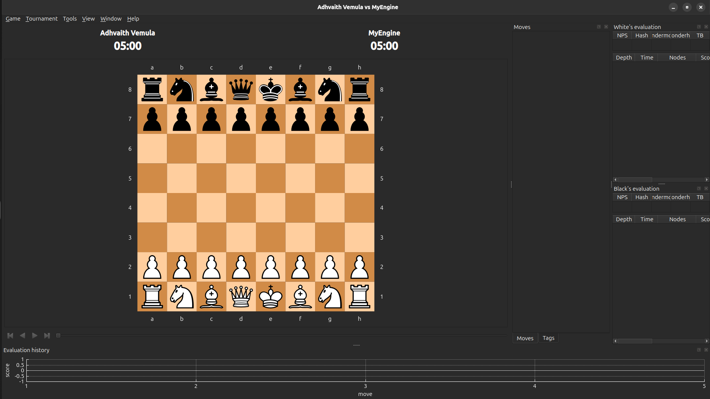

# ♟️ ChessEngine

<p align="center">
  
  
  
  
  
  
</p>

<p align="center">
  A UCI-compliant chess engine written from scratch in C++, built on a bitboard board representation with full legal move generation, Zobrist-hashed transposition tables, and a material + positional evaluation system — designed to plug directly into standard chess GUIs and play head-to-head against other engines.
</p>

---

## 📌 Overview

**ChessEngine** is a from-scratch chess engine built to explore the low-level representation, search, and evaluation techniques that power competitive game-playing AI. Every core system — board state, move generation, evaluation, and search — is implemented manually in C++, with correctness treated as a first-class concern rather than an afterthought.

The engine represents the board using **64-bit bitboards**, one per piece type per color, enabling piece storage, occupancy tracking, and attack calculation to be done with fast bitwise operations instead of array scans. On top of that foundation sits a **fully validated legal move generator** (including all special-move edge cases), a **material + positional evaluation function**, a **negamax search with alpha-beta pruning**, and a **Zobrist-hashed transposition table** that caches previously searched positions to avoid redundant work — all exposed through a **UCI-compatible interface** so it can be dropped into any standard chess GUI.

---

## ✨ Features

| Feature | Description |
|---|---|
| ♟️ **Bitboard Board Representation** | Board state stored as 64-bit integers per piece type/color for fast occupancy tracking and attack generation |
| 🎯 **Full Legal Move Generation** | Castling, en passant, promotions, captures, and check detection — all handled explicitly |
| ↔️ **Make/Unmake Move Logic** | Reversible move application for efficient search without full board copies |
| ✅ **Perft Testing** | Move generation correctness validated against known node-count references at multiple depths |
| 🧮 **Material + Piece-Square Table Evaluation** | Position scoring combining material balance with positional piece-placement tables |
| 🧪 **Dedicated Evaluation Tests** | Unit tests verifying material and positional scoring behave as expected |
| 🔑 **Zobrist Hashing** | Incremental 64-bit position hashing for fast, collision-resistant position identification |
| 📦 **Transposition Table** | Caches previously evaluated positions, keyed by Zobrist hash, to reduce repeated search work |
| 🔁 **Negamax Search with Alpha-Beta Pruning** | Unified minimax variant with alpha-beta cutoffs to prune provably irrelevant branches |
| 🔍 **Search Framework with Node Tracking** | Search loop instrumented to track nodes visited, supporting move ordering and performance analysis |
| 🎯 **Move Ordering Concepts** | Ordering logic to search stronger candidate moves earlier and improve pruning efficiency |
| 🔌 **UCI Protocol Support** | Communicates over stdin/stdout using the UCI standard for GUI integration |

---

## ⚙️ How It Works

### 🧩 Bitboard Board Representation
Each piece type and color (e.g., white pawns, black knights) is stored as a separate 64-bit integer, where each bit represents a square's occupancy. This lets operations like generating attacks, checking occupancy, or finding piece locations be done with **constant-time bitwise operations** (AND, OR, XOR, shifts) instead of looping over an 8x8 array — a significant efficiency advantage as search depth increases.

### 🎯 Legal Move Generation
Move generation handles the full rule set of chess: normal moves, captures, castling (with rights and path-safety checks), en passant, and promotions. **Check detection** is layered in to filter out moves that would leave the king in check, ensuring only fully legal moves are ever passed to search.

### ↔️ Make/Unmake Move Logic
Rather than copying the entire board state at every search node, moves are applied via **make/unmake**: a move mutates the board in place, and an inverse operation restores the exact prior state (including castling rights, en passant target, and captured pieces) after the branch is explored. This avoids expensive board copies at every node of the search tree.

### ✅ Perft Testing
Perft ("**per**formance **t**est") recursively counts leaf nodes at a given depth and compares the result against known-correct reference values for standard test positions. This is how subtle move-generation bugs — in castling rights, en passant direction, or promotion handling — get caught systematically rather than through manual play-testing.

### 🧮 Evaluation: Material + Piece-Square Tables
Position strength is scored using two components: **material balance** (sum of piece values) and **piece-square tables**, which reward or penalize pieces for occupying strategically strong or weak squares (e.g., centralized knights, advanced pawns). Dedicated evaluation tests verify this scoring behaves correctly on known positions.

### 🔑 Zobrist Hashing
Each piece-square combination, castling right, en passant file, and side-to-move is assigned a random 64-bit value at startup. A position's hash is the XOR of all applicable values, **updated incrementally** with each move rather than recomputed from scratch, giving a fast, reliable key for identifying and comparing positions during search.

### 📦 Transposition Table
Since many move sequences transpose into the same position, the transposition table stores previously computed search results keyed by Zobrist hash. When the same position is reached again, **cached results are reused instead of re-searched**, cutting down substantially on redundant work as search depth grows.

### 🔁 Negamax Search with Alpha-Beta Pruning
The search is structured as **negamax** — a minimax variant that exploits the zero-sum symmetry of chess to collapse maximizing/minimizing logic into a single recursive function, `max(-search(opponent))`. Layered on top is **alpha-beta pruning**: as the search explores moves, it maintains a `[α, β]` window of guaranteed outcomes found so far, and cuts off branches that are provably worse than an already-found alternative without fully exploring them. In the best case this reduces the effective branching factor from `b` to roughly `√b`, letting the engine search meaningfully deeper within the same node budget.

### 🔍 Node Tracking & Move Ordering
The search framework tracks the number of nodes visited per search, used both for performance measurement and as a diagnostic signal when tuning move ordering. Move ordering matters because alpha-beta pruning is only as effective as the order moves are searched in — stronger candidate moves found earlier trigger more cutoffs. Move ordering logic prioritizes promising candidates first to maximize pruning efficiency.

---

## 🏗️ Architecture

```
ChessEngine/
├── src/
│   ├── bitboard.cpp / bitboard.h     # Bitboard representation & bit operations
│   ├── board.cpp / board.h           # Board state, make/unmake move logic
│   ├── movegen.cpp / movegen.h       # Legal move generation (incl. castling, en passant, promotions)
│   ├── evaluate.cpp / evaluate.h     # Material + piece-square table evaluation
│   ├── zobrist.cpp / zobrist.h       # Zobrist hashing
│   ├── transposition.cpp / .h        # Transposition table
│   ├── search.cpp / search.h         # Search framework, node tracking, move ordering
│   ├── uci.cpp / uci.h               # UCI protocol handler
│   └── main.cpp                      # Entry point
├── tests/
│   ├── perft.cpp                     # Move generation correctness tests
│   └── evaluate_tests.cpp            # Evaluation correctness tests
├── CMakeLists.txt
└── README.md
```

**Design principle:** board representation, move generation, evaluation, and search are fully decoupled modules — this isolation made it possible to unit-test evaluation independently and validate move generation exhaustively via Perft, without either system masking bugs in the other.

---

## 🚀 Build & Run

### Prerequisites
- C++17-compatible compiler (GCC / Clang / MSVC)
- CMake ≥ 3.15

### Build

```bash
git clone https://github.com/<your-username>/ChessEngine.git
cd ChessEngine
mkdir build && cd build
cmake ..
make
```

### Run in UCI mode

```bash
./ChessEngine
```

The engine idles, waiting for UCI commands over stdin — this is expected behavior; it's designed to be driven by a GUI or script rather than used interactively.

### Example UCI session

```
> uci
id name ChessEngine
id author <Your Name>
uciok
> isready
readyok
> position startpos moves e2e4 e7e5
> go depth 6
info depth 6 score cp 24 nodes 184320 nps 921600 pv g1f3
bestmove g1f3
```

### Run Perft tests

```bash
./ChessEngine --perft 5
```

```
Perft(5) from startpos: 4,865,609 nodes ✅ (matches known reference value)
```

### Run evaluation tests

```bash
./ChessEngine --run-eval-tests
```

---

## 🔌 Connecting to a Chess GUI

ChessEngine speaks standard UCI, so it works out of the box with any UCI-compatible GUI.

### Cute Chess

1. Open **Cute Chess** → `Tools` → `Settings` → `Engines` → `Add`
2. Set the command path to your built `ChessEngine` binary
3. Set protocol to **UCI**
4. Start a new game and select ChessEngine as one (or both) players

### Arena

1. Open **Arena** → `Engines` → `Install New Engine`
2. Browse to the `ChessEngine` executable
3. Select **UCI** as the protocol
4. Assign it to a player slot and start a match

Once connected, the engine can play full games, be benchmarked against other engines, or be exercised through automated GUI tournament tools.

---

## 🖼️ Gameplay

<p align="center">
  
</p>

---

## 📊 Performance Highlights

| Metric | Result |
|---|---|
| Perft(5) from starting position | 4,865,609 nodes — ✅ matches reference |
| Board representation | Bitboard-based, 64-bit bitwise occupancy/attack operations |
| Move application | Make/unmake — no full board copies during search |
| Search algorithm | Negamax with alpha-beta pruning — reduced effective branching factor |
| Transposition table | Reduces repeated search work on transposed positions |
| Evaluation | Material + piece-square tables, verified via dedicated unit tests |

*(Fill in with your actual benchmarked node counts / NPS / search depth once measured — concrete numbers are more compelling than qualitative claims.)*

---

## 🔮 Future Improvements

- [ ] **Iterative deepening** with time-based cutoffs for tournament play
- [ ] **MVV-LVA and killer move heuristics** to strengthen move ordering and increase alpha-beta cutoff rate
- [ ] **Quiescence search** to avoid horizon-effect blunders at leaf nodes
- [ ] **Magic bitboards** for faster sliding-piece attack generation
- [ ] **Opening book** integration
- [ ] **Endgame tablebases** for perfect endgame play
- [ ] **Multi-threaded search** (Lazy SMP)
- [ ] **NNUE-style evaluation** as a learning extension beyond hand-crafted evaluation

---

## 🛠️ Tech Stack

`C++17` · `CMake` · `Bitboards` · `UCI Protocol` · `Perft Testing`

---

## 📄 License

This project is licensed under the MIT License — see [LICENSE](LICENSE) for details.

---

<p align="center">
  Built as a deep dive into board representation, move generation correctness, evaluation design, and search-efficiency engineering.
</p>
